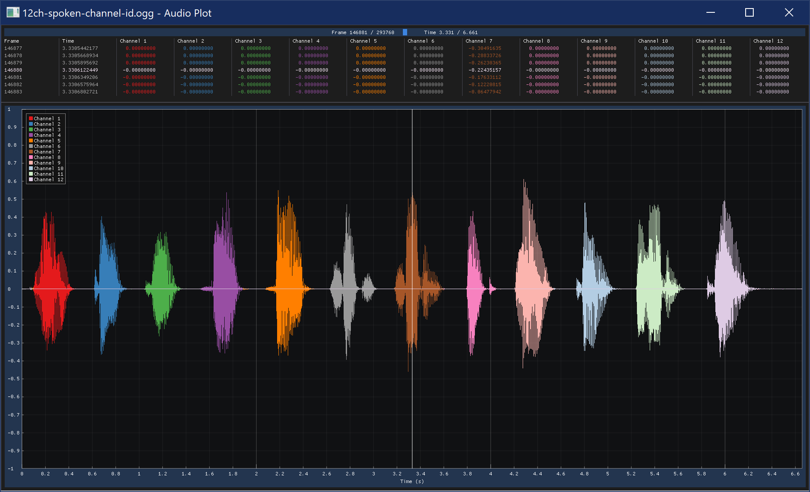
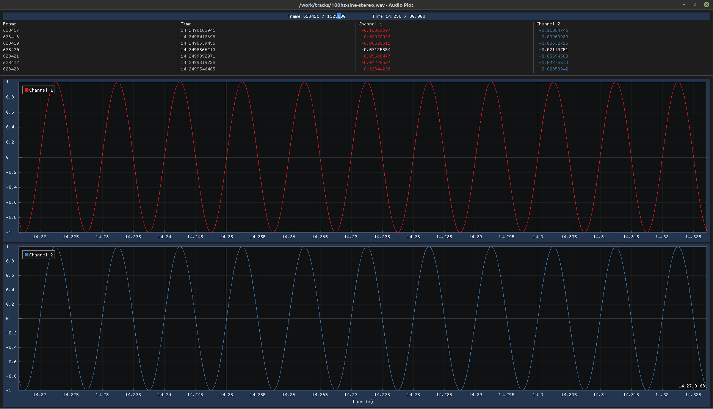

# Audioplot

Audioplot is a simple cross-platform waveform viewer for audio files.

## Usage

Open a file browser to select a file:

    audioplot.exe

Open a supported audio file in the audioplot gui:

    audioplot.exe song.mp3
    audioplot.exe song.wav
    audioplot.exe song.ogg

## Keyboard Controls

    Esc Key                          --> Exit audioplot
    Arrow Keys                       --> Scroll Cursor Slow (Up/Down) or Fast (Left/Right)
    W/A/S/D keys                     --> Horizontal Pan (A/D) and Zoom (W/S)
    Q/E keys                         --> Vertical Zoom (Q/E)
    Space Bar                        --> Reset Pan and Zoom
    Tab Key                          --> Switch Plot Modes (Combined, Split, Multiple)
    Number Keys (12345667890)        --> Toggle Exclusive View of Channel 1-10
    Shift + Number Keys              --> Toggle Exclusive View of Channel 11-20
    Ctrl + Number Keys               --> Show/Hide Channel 1-10
    Ctrl + Shift + Number Keys       --> Show/Hide Channel 11-20
    Backtick Key (`)                 --> Show All Channels

## Mouse Controls

    Scroll Up/Down                   --> Zoom In/Out
    Middle Click-and-Drag Left/Right --> Move Cursor
    Left Click-and-Drag Left/Right   --> Pan Left/Right

## Building

### Windows

Audioplot has been built and tested successfully on 64-bit Windows 10 with mingw-w64
and GCC 9.2.0.

### Linux

Audioplot has been built and tested successfully on 64-bit Linux Mint 19 with GCC
7.5.0.

You may need to install `xorg-dev` and/or `libglfw3-dev` packages to build successfully.

    sudo apt-get install xorg-dev
    sudo apt-get install libglfw3-dev

### Third-Party Dependencies

The necessary third-party files for building audioplot have been copied from their
original repository into the `thirdparty` subdirectory.

The `get_deps.sh` script clones the appropriate third-party repositories, so they are
available for development, for example, to incorporate upstream changes.

### Third-Party Licenses

- dr_libs/README.md                (public domain)
- gl3w/GL/glcorearb.h              (MIT license)
- glfw/LICENSE.md                  (zlib/libpng license)
- imgui/LICENSE.txt                (MIT license)
- implot/LICENSE                   (MIT license)
- portable-file-dialogs/COPYING    (WTFPL)
- stb/LICENSE                      (MIT license/public domain)
